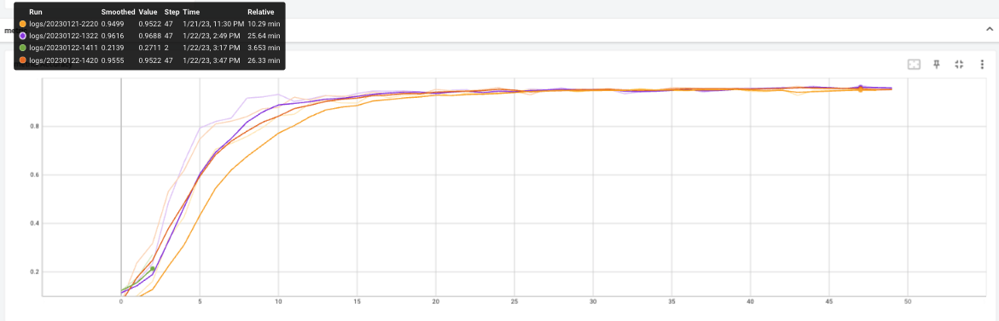
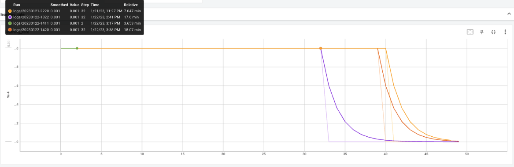
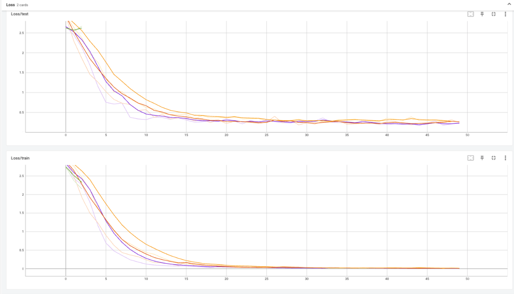
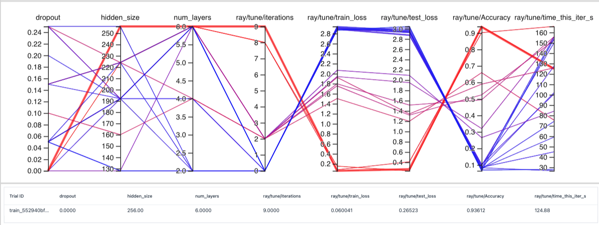
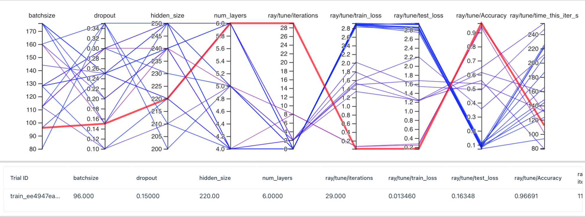
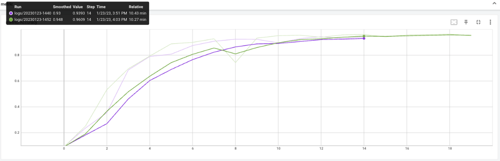
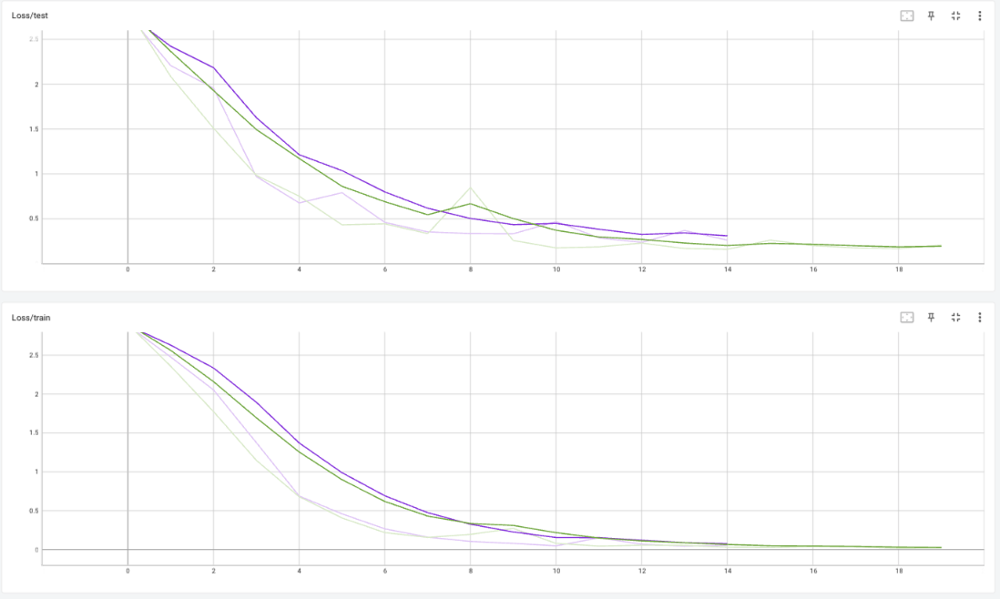

# Tentamen ML2022-2023

De opdracht is om de audio van 10 cijfers, uitgesproken door zowel mannen als vrouwen, te classificeren. De dataset bevat timeseries met een wisselende lengte.

In [references/documentation.html](references/documentation.html) lees je o.a. dat elke timestep 13 features heeft.
Jouw junior collega heeft een neuraal netwerk gebouwd, maar het lukt hem niet om de accuracy boven de 67% te krijgen. Aangezien jij de cursus Machine Learning bijna succesvol hebt afgerond hoopt hij dat jij een paar betere ideeen hebt.

## Vraag 1

### 1a
In `dev/scripts` vind je de file `01_model_design.py`.
Het model in deze file heeft in de eerste hidden layer 100 units, in de tweede layer 10 units, dit heeft jouw collega ergens op stack overflow gevonden en hij had gelezen dat dit een goed model zou zijn.
De dropout staat op 0.5, hij heeft in een blog gelezen dat dit de beste settings voor dropout zou zijn.

- Wat vind je van de architectuur die hij heeft uitgekozen (een Neuraal netwerk met drie Linear layers)? Wat zijn sterke en zwakke kanten van een model als dit in het algemeen? En voor dit specifieke probleem?
- Wat vind je van de keuzes die hij heeft gemaakt in de LinearConfig voor het aantal units ten opzichte van de data? En van de dropout?

# <b>ML: Antwoord 1a</b>
Het lijkt een regressie probleem doordat er onder andere cijfers voorspeld dienen te worden, maar het betreft een classificatie probleem, het voorspellen van 20 classes: cijfers 0 t/m 9 van mannen en vrouwen.

Een neuraal netwerk met meerdere lineaire lagen is een goede architectuur om mee te starten (baseline). Dit type model is geschikt voor zowel regressie als classificatie problemen en wordt veelal gebruikt voor beeld- en taalclassificatie.

Sterke punten:
  * Ideaal om te gebruiken als baselinemodel.
  * Relatief simpel model dat uitlegbaar is.
  * Weinig lagen, dus minder complexiteit.
  * Eenvoudigheid van het model helpt bij het voorkomen van overfitten.
  * Goed toepasbaar op minder complexe problemen.

Zwakke punten:
  * Door eenvoudigheid gaat deze underfitten op non-lineaire datasets. 
  * Accuracy zal met dit model niet gemakkelijk te verhogen zijn doordat er relatief weinig features te trainen zijn.
  * Werkt niet voor grote hoeveelheden data die veel features hebben.

Gezien de gesproken cijfers met tijd te maken hebben gaat het om timeseries waarbij de volgordelijkheid erg van belang is. Een model met 'geheugen' zou beter zijn gezien de volgordelijkheid van timeseries: denk hierbij aan Simple RNN, LSTM en GRU. Een Simple RNN model heeft hoogstwaarschijnlijk moeite met de volgordelijkheid, gezien het beperkte 'geheugen'. Hierdoor zou een LSTM of GRU model betere resultaten kunnen behalen.

Keuze aantal units ten opzichte van de data:
- input = 13
- hidden1 = 100
- hidden2 = 10
- output = 20
- dropout = 0,5
- Dataset = 8800 (10 digits x 10 repetitions x 88 speakers) van 44 mannen en 44 vrouwen. Batchsize = 128

Input komt overeen met het aantal attributen: 13. Deze attributen bestaan uit regels met timeseries van 13 Frequency Cepstral Coefficients (MFCCs).

Door het aantal units als eerste te vergroten, vervolgens te verkleinen en dan weer te vergroten om terug te gaan naar 20 classes is niet logisch. Het is logischer om van groot naar klein te werken, hierdoor dient de eerst laag het grootst te zijn. In deze situatie is de input 13 units, deze te vergroten naar een veelvoud van twee. Denk hierbij aan de volgende reeks die we ook hebben toegepast tijdens het handmatig hypertunen. Hierdoor is gemakkelijker om een passende range te vinden waarbij de units optimaal zijn: 8, 16, 32, 64, 128, 256 en 512. Veel meer units zal niet nodig zijn gezien de beperkte grote van de dataset. Als baseline zou ik in dit geval de eerste hidden layer de op 128 units hebben gezet, de tweede layer dus kleiner maken en op 64 units hebben gezet aangezien de output layer terug gaat naar 20 classes.

Daarnaast wordt er gebruik gemaakt van een dropout van 0,5 wat voor een relatief kleine dataset aan de hoge kant is. Door de dropout wordt er random in iedere batch de helft van de gegevens tussen de hiddenlayers weggegooid. Hierdoor kunnen units die aan het overfitten zijn verminderd worden, wat het risico op overfitten verkleind. Ik zou op basis van onderbuik gevoel de dropout verlagen naar 0,3. Echter is het erg afhankelijk van de kenmerken van de dataset welke dropout het beste werkt, daarom is het goed om te gaan experimenteren met de waarde van de dropout.

Mijn initiele model zou de volgende settings krijgen:
- input = 13
- hidden1 = 128
- hidden2 = 64
- output = 20
- dropout = 0,3

## 1b
Als je in de forward methode van het Linear model kijkt (in `tentamen/model.py`) dan kun je zien dat het eerste dat hij doet `x.mean(dim=1)` is. 

- Wat is het effect hiervan? Welk probleem probeert hij hier op te lossen? (maw, wat gaat er fout als hij dit niet doet?)
- Hoe had hij dit ook kunnen oplossen?
- Wat zijn voor een nadelen van de verschillende manieren om deze stap te doen?

# <b>ML: Antwoord 1b</b>
Het effect van 'x.mean(dim=1)' is dat het aantal dimensies wordt gereduceerd. De tijdsdimensie kan verschillende lengtes hebben, het ene cijfer duurt langer om uit gesproken te worden dan de ander. Door alleen het gemiddelde te nemen wordt de tijdsdimensie gereduceerd, hadden we dit niet gedaan dan had het neurale netwerk de gehele tijdserie van elke sample moeten verwerken wat er voorzorgt dat het trainingsproces veel langzamer wordt. Het netwerk krijgt te veel features om te verwerken waardoor het moeilijker wordt om van de data te leren. Tevens wordt de het toepassen van x.mean(dim=1) ook de ruis verminderd, die ontstaat door de verschillende lengtes van de tijdsdimensie.

Een alternatief voor het reduceren van de dimensies is het toepassen van een flatten. Door flatten wordt alle informatie uit de dimensies platgeslagen tot een reeks. Echter door het toepassen van flatten gaan er veel kenmerken van tijdserie verloren. Daarom is het toepassen van flatten niet optimaal voor het verwerken van tijdseries.

### 1c
Omdat jij de cursus Machine Learning hebt gevolgd kun jij hem uitstekend uitleggen wat een betere architectuur zou zijn.

- Beschrijf de architecturen die je kunt overwegen voor een probleem als dit. Het is voldoende als je beschrijft welke layers in welke combinaties je zou kunnen gebruiken.
- Geef vervolgens een indicatie en motivatie voor het aantal units/filters/kernelsize etc voor elke laag die je gebruikt, en hoe je omgaat met overgangen (bv van 3 naar 2 dimensies). Een indicatie is bijvoorbeeld een educated guess voor een aantal units, plus een boven en ondergrens voor het aantal units. Met een motivatie laat je zien dat jouw keuze niet een random selectie is, maar dat je 1) andere problemen hebt gezien en dit probleem daartegen kunt afzetten en 2) een besef hebt van de consquenties van het kiezen van een range.
- Geef aan wat jij verwacht dat de meest veelbelovende architectuur is, en waarom (opnieuw, laat zien dat je niet random getallen noemt, of keuzes maakt, maar dat jij je keuze baseert op ervaring die je hebt opgedaan met andere problemen).

# <b>ML: Antwoord 1c</b>
De verschillende architecturen die dit problemen zijn zoals eerder benoemd de volgende:
- Simple RNN: Basis model, echter moeite met geheugen.
- LSTM: Heeft meer parameters met 3 gates en 2 hidden states, dus een meer complex model.
- GRU: Versimpelde versie van LSTM met 2 gates en 1 hidden states.

<figure>
  

    
    <figcaption align="center">
      <b> Fig 1c. Overzicht Architecturen</b>
    </figcaption>
  

</figure>

Deze architecturen zijn het best toepasbaar voor timeseries data aangezien ze beschikken over geheugen.

In deze casus is mijn verwachting dat het GRU model het beste is, gezien dat een Simple RNN beperking in het gebruik van geheugen heeft. Een LSTM model is te complex voor deze relatief simpele dataset, echter is het geheugen wel veel beter ten opzichte van een Simple RNN Model. Gezien GRU de versimpelde versie van LSTM, zie ik GRU als het meest veelbelovende model.

Educated guess: op basis van oefening les, onderbuikt.. NOG VERDER TOELICHTEN!
- Hidden size: 64
  - Gezien er meerdere lagen in het model zitten had ik een onderbuik gevoel dat de hidden size relatief klein kon zijn.
- Aantal lagen: 4
  - Op basis van de oefeningen uit de les in combinatie met compacte dataset zou dit voldoende moeten zijn met 4 lagen die verder getraind kunnen worden.
- Dropout: 0.3
  - Geen dropout van 0.5 doordat er dan mogelijk te veel data van de kleine dataset wordt weggegooid.
- Batchsize: 128 
  - (default van eerste model, zal in hypertunen gaan varieren)
- Learning rate: 1e-3
  - Gedurende de module de best werkende learningrate.
- Optimizer: Adam
  - Vaak de beste optimzer in combinatie met learning rate van 1e -3.
- Loss functie: CrossEntropyLoss
  - Gezien het om classificatie is deze loss functie het beste.

### 1d
Implementeer jouw veelbelovende model: 

- Maak in `model.py` een nieuw nn.Module met jouw architectuur
- Maak in `settings.py` een nieuwe config voor jouw model
- Train het model met enkele educated guesses van parameters. 
- Rapporteer je bevindingen. Ga hier niet te uitgebreid hypertunen (dat is vraag 2), maar rapporteer (met een afbeelding in `antwoorden/img` die je linkt naar jouw .md antwoord) voor bijvoorbeeld drie verschillende parametersets hoe de train/test loss curve verloopt.
- reflecteer op deze eerste verkenning van je model. Wat valt op, wat vind je interessant, wat had je niet verwacht, welk inzicht neem je mee naar de hypertuning.

Hieronder een voorbeeld hoe je een plaatje met caption zou kunnen invoegen.

<figure>
  

    
    <figcaption align="center">
      <b> Fig 1.Een motivational poster voor studenten Machine Learning (Stable Diffusion)</b>
    </figcaption>
  

</figure>

# <b>ML: Antwoord 1d</b>
In model.py file heb ik nieuw model toegevoegd: class 'GRUmodel', hierin is de gebruikte architectuur te vinden. Tevens heb ik in de settings.py file de config voor het model toegevoegd: class 'GRUmodelConfig', hierin worden het type van de verwachtte input geconfigureerd. Om het GRUmodel te runnen en de architectuur van het initiele model(01_model_design.py) te behouden heb ik een nieuw script aangemaakt (01_model_GRU_design.py). Om dit model losstaand van het eerste model te laten runnen heb ik de Makefile moeten aanpassen zodat ik een 'make' commando kon geven voor alle dit model: 'make runGRU'. Voor het handmatig hypertunen ben ik gaan experimenteren met de volgende parameters: hidden_size, aantal lagen en dropout. De overige parameters hebben de volgende default settings van mij meegekregen:
- Batchsize = 128
- Learningrate = 1e -3
- Optimizer = Adam
- Loss = CrossEntropyLoss

### <b>Experiment 1d.1 Logs/20230121-2220 > Gele lijn in onderstaande figuren.</b>
Zoals in in vraag 1c benoemd heb ik in eerste instantie het model gerund met de educated guess: 
- Hidden size = 64
- Aantal lagen = 4
- Dropout = 0.3

Wat valt op: Na 13 epochs zit de accuracy al boven de 90%. Vervolgens is er na 25/30 epochs al een accuracy van 95% behaald. Dit betreft al een hele goede accuracy. Daarnaast valt op dat de learningrate na 40 epochts terugvalt, wat betekent dat het model op die learningrate niets meer aan het leren was. Het model heeft ingestelde patience van 10, wat betekent dat als het model gedurende 10 epochs niets leert het de learningrate laat zakken. Verder positief is dat het model is niet aan het overfitten is: Zowel de Loss/test als de Loss/train curve zitten op hetzelfde niveau.

### <b>Experiment 1d.2 > Logs/20230122-1322 > Paarse lijn in onderstaande figuren.</b>
- Hidden size = 128
- Aantal lagen = 6
- Dropout = 0.3

Wat valt op: De tweede versie van het GRUmodel lijkt nog sneller en beter te leren dan de eerste educated guess. Na slechts 8 epochs zit de accuracy al boven de 90%. Uiteindelijk haalt het model een accuracy van rond de 96 a 97%. Net als in de eerste experiment wordt opgegeven moment de learningrate verlaagd tot 0.0009 om verder te kunnen leren. Door dat dit model sneller leert, wordt de learningrate al bij epoch 32 verlaagd. Net als in de eerste run is het model niet aan het overfitten, wel is te zien dat deze run relatief minder aan het overfitten is, ookal gebeurd het nu bijna niet. Een grotere hidden size en aantal lagen lijkt goed te werken om de accuracy te verhogen. 

### <b>Experiment 1d.3 > Logs/20230122-1411 > Experiment afgebroken > Groene lijn in onderstaande figuren.</b>
- Hidden size = 256
- Aantal lagen = 8
- Dropout = 0.3

Naar aanleiding van experiment 1d.2 lijkt het erop dat door middel van het verhogen van de hidden size en het aantal lagen het model beter werd. Geen aanpassingen op de dropout gedaan. Echter werd het model hierdoor erg traag, om deze reden de run afgebroken. Op basis van de eerste paar epochs leek het model wel sneller te leren dan de twee voorgaande versies. Doordat de run is afgebroken, heb ik toch besloten om een volledige derde run te doen met de beste settings tot nu toe in combinatie met een verhoging van de dropout.

### <b>Experiment 1d.4 > Logs/20230122-1420 > Oranje lijn in onderstaande figuren.</b>
- Hidden size = 128
- Aantal lagen = 6
- Dropout = 0.5

Net als voorgaande experimenten wordt er goede accuracy gehaald van 95%. Het model duurt er een aantal langer over om boven de 90% te doen dan experiment 1d.2. Qua leervermogen worden wordt de learningrate na 39 epochs verlaagd, het model is dus later uitgeleerd. Ook met deze settings is model niet aan het overfitten. Wel kan er gesteld worden dat een lagere dropout beter is.

Mijn conclusie op basis van deze experimenten valt het volgende mij op. Van alle modellen kwam de accuracy al redelijk snel boven de 95%, dit had ik niet verwacht aangezien er bij de eerdere opdracht gesteld werd dan een accuracy boven de 93% al goed is. Wat blijkt dat meer lagen zorgen voor een beter resultaat maar wel een slechtere performance (run time). Voor het opvolgend hypertunen ga ik dus niet meer lagen toevoegen dan 6 gezien het anders te veel tijd gaat kosten. Wanneer er meer tijd was zou ik het zeker interessant vinden om dit verder te onderzoeken. Wat tevens op viel dat mijn eerste educated guess aardig goed was qua parameters, echter lijkt een hogere hidden size beter. Hiermee ga ik verder experimenteren tijdens het hypertunen. Naar aanleiding van bovenstaande bevindingen, worden deze hieronder visueel weergegeven.

<figure>
  

    
    <figcaption align="center">
      <b> Fig 1d.1 Metric Accuracy.</b> x-as = Accuracy en y-as = Aantal epochs
    </figcaption>
  

</figure>
<i>Uit bovenstaande visual is te zien dat accuracy van experiment 1d.2 het snelst de hoogste accuracy bereikt. Ook is te zien dat de uiteindelijke accuracy voor experiment 1d.2 het hoogste. Dit is ook te herleiden op basis van de logs in map: '01.Log'.</i>

<figure>
  

    
    <figcaption align="center">
      <b> Fig 1d.2 Drop LearningRates.</b> x-as = LearningRate en y-as = Aantal epochs
    </figcaption>
  

</figure>
<I>Uit bovenstaande visual is de patience voor elk van deze experimenten duidelijk zichtbaar. Na 10 epochs van niets leren wordt de learning rate verlaagd. Op basis van de paarse lijn kan er gesteld worden dat het model na 22 epochs niet meer leert met een learningrate van 0.001.</i>

<figure>
  

    
    <figcaption align="center">
      <b> Fig 1d.3 LossTrain/LossTest.</b> x-as = Loss/test & Loss/train en y-as = Aantal epochs
    </figcaption>
  

</figure>
<i>Uit bovenstaande visual is te zien dat het model in geen van alle uitgevoerde experimenten is gaan overfitten, ondanks dat het model heeft gerund op 50 epochs. Door dit hoge aantal epochs is de kans op overfitten groot, maar dit is uiteindelijk niet gebeurd.</i>

## Vraag 2
Een andere collega heeft alvast een hypertuning opgezet in `dev/scripts/02_tune.py`.

### 2a
Implementeer de hypertuning voor jouw architectuur:
- zorg dat je model geschikt is voor hypertuning
- je mag je model nog wat aanpassen, als vraag 1d daar aanleiding toe geeft. Als je in 1d een ander model gebruikt dan hier, geef je model dan een andere naam zodat ik ze naast elkaar kan zien.
- Stel dat je je model aanpast, maak dan even een tweede model aan. Pas je een dataloader aan, maak dan een nieuwe dataloader > Benoemd in de les toevoeging Raoul
- voeg jouw model in op de juiste plek in de `tune.py` file.
- maak een zoekruimte aan met behulp van pydantic (naar het voorbeeld van LinearSearchSpace), maar pas het aan voor jouw model.
- Licht je keuzes toe: wat hypertune je, en wat niet? Waarom? En in welke ranges zoek je, en waarom? Zie ook de [docs van ray over search space](https://docs.ray.io/en/latest/tune/api_docs/search_space.html#tune-sample-docs) en voor [rondom search algoritmes](https://docs.ray.io/en/latest/tune/api_docs/suggestion.html#bohb-tune-search-bohb-tunebohb) voor meer opties en voorbeelden.

### 2b
- Analyseer de resultaten van jouw hypertuning; visualiseer de parameters van jouw hypertuning en sla het resultaat van die visualisatie op in `reports/img`. Suggesties: `parallel_coordinates` kan handig zijn, maar een goed gekozen histogram of scatterplot met goede kleuren is in sommige situaties duidelijker! Denk aan x en y labels, een titel en units voor de assen.
- reflecteer op de hypertuning. Wat werkt wel, wat werkt niet, wat vind je verrassend, wat zijn trade-offs die je ziet in de hypertuning, wat zijn afwegingen bij het kiezen van een uiteindelijke hyperparametersetting.

Importeer de afbeeldingen in jouw antwoorden, reflecteer op je experiment, en geef een interpretatie en toelichting op wat je ziet.

# <b>ML: Antwoorden 2a en 2b </b>
Naar aanleiding van het handmatig hypertunen van vraag 1d geen wijzigingen meer in het gekozen model doorgevoerd. Het GRUmodel werkt erg goed voor deze dataset.

### <b> Hypertuner</b>
Om de basiscode in file '02_tune.py' voor het lineaire model te behouden heb ik hiervan een kopie gemaakt en deze gewijzigd zodat deze kan runnen op het GRUmodel (02_tune_GRU.py). Voor het runnen van deze hypertuner ook een nieuw command aangemaakt in de Makefile: 'make tuneGRU'. In de settingsfile een GRUmodelSearchSpace toegevoegd met searchspace op basis van het handmatig hypertunen:

class GRUmodelSearchSpace(BaseSearchSpace):
    hidden_size: (128, 256)
    num_layers: (2, 6)
    dropout: (0.0, 0.3)

Op basis van deze settings gaat de search erg random. Door deze te structeren door het gebruik van tune.qrandint en tune.quniform. Hierdoor kan de grote van elke stap bepaald worden. Bijvoorbeeld door het toevoegen van 32 aan de range van hidden size (128, 256) word de random integers een veelvoud van 32. Zo wordt het overzichtelijker om vast te stellen in welke range bijvoorbeeld de hidden size het beste resultaat geeft. Dit veelvoud is ook toegevoegd bij het zoeken naar de juiste dropout (veelvoud van 0.05) en aantal lagen(veelvoud van 2). Vervolgens ben ik het experiment gaan runnen op 10 epochs, aangezien op basis van dit aantal epochs de betere settings inzichtelijk worden.

<figure>
  

    
    <figcaption align="center">
      <b> Fig 2ab.1 Eerste Run Hypertuner.</b> <i>Onder de parallel_coordinates-visual zijn de settings zichtbaar die in deze run de hoogste accuracy heeft gehaald (rode lijn).</i>
    </figcaption>
  

</figure>

Het hypertunen gaat door te werken met een veelvoud meer gestructureerd dan wanneer er gerund wordt op volledig random integers/floats. Uit deze run blijkt dat de volgende settings optimaal zijn: hidden size = 224, aantal lagen = 6 en dropout = 0.0. Een dropout van 0.0 is niet logisch aangezien er bij het handmatig hypertunen bijna een accuracy van 97% werd behaald met een dropout van 0.3. Door de train_loss en test_loss te analyseren is te zien dat het model niet aan het overfitten was. Zoals verwacht is een hogere hiddensize en een hoger aantal lagen een betere setting. Wat tevens nogmaals bevestigd wordt is dat de run time niet snel is, dit komt door het hoge aantal lagen. Hierdoor ga ik ook neit verder experimenteren met meer lagen dan zes. Om verder de beste settings te kunnen analyseren ga ik het model opnieuw laten runnen. Tevens wil ik bij deze nieuwe run de batchsize als variabele setting toevoegen. Tijdens de lessen is duidelijk geworden dat deze parameter ook erg van belang is om het optimale resultaat te behalen. Ik vind een batchsize van 128 op een dataset van 8800 redelijk aan de hoge kant.

Op basis van voorgaande experimenten verwacht ik dat het model de volgende settings een beter resultaat behaald:
- hidden_size: (200, 260, 10) > Verwachting dat de hidden size hoog is.
- num_layers: (4, 6, 1) > Verwachting de aantal lagen ook hoog is.
- dropout: (0.1, 0.4, 0.05) > Verwachting dat er een hogere dropout is dan 0.1 en niet hoger dan 0.4.
- batchsize: (64, 182, 16) > Verwachting dat batchsize lager zal dan de default, maar een grotere range meegegeven om dit bevestigd te krijgen.

Bovenstaande heb ik in de nacht laten runnen om deze reden heb ik aantal epochs op 30 gezet. Op basis van deze 'nachtrun' is het volgende resultaat behaald.

<figure>
  

    
    <figcaption align="center">
      <b> Fig 2ab.2 Resultaat Hypertuner.</b> <i>Onder de parallel_coordinates-visual zijn de settings zichtbaar die in deze run de hoogste accuracy heeft gehaald (rode lijn).</i>
    </figcaption>
  

</figure>

De volgende settings hebben het beste resultaat behaald:
- hidden_ size = 220
- num_layers = 6
- dropout = 0.15
- batchsize = 96
- <b>Accuracy 96,69%</b>

De verwachting is bevestigd door dit resultaat. Een hoge hidden_size en hogere aantal lagen geeft een beter resultaat, echter gaat dit wel ten kosten van de performance (run time) van het model. Wat tevens op valt dat het model in geen van de gevallen echt gaan overfitten is. Bij een hoger aantal epochs loopt de test/loss een klein beetje omhoog. Na ongeveer 15 a 20 epochs leert het model weinig meer bij en heeft het dus ook geen toegevoegde waarde meer om langer door te laten draaien. Daarnaast is een iets lagere batchsize beter voor zo'n relatief kleine dataset doordat het dan langer duurt voordat alles een keer is gezien door het model. Bij een grotere batchsize is er een grotere risico dat het model de data onthoudt.

### 2c
- Zorg dat jouw prijswinnende settings in een config komen te staan in `settings.py`, en train daarmee een model met een optimaal aantal epochs, daarvoor kun je `01_model_design.py` kopieren en hernoemen naar `2c_model_design.py`.

# <b>ML: Antwoord 2c </b>

De beste settings vloeienvoort uit het GRUmodel. Dit model heb ik gekopieerd naar `2c_model_design.py`. In dit script heb ik direct de juiste configuraties meegegeven aan het model om vervolgens te laten runnen op een optimaal aantal epochs. Op basis van de gerunde experimenten zit het optimale epochts rond de 15 a 20 epochs. Hierna is de verbetering nihil. Om dit te script te runnen heb ik nieuw command aangemaakt: 'make runBEST'. 

In eerste instantie had ik het model op 15 epochs gezet, echter werd er toen ik die liet runnen slechts een accuracy va 94% behaald. Ik weet dat dit een momentopname is, maar hierdoor het aantal epochs toch aangepast tot 20. Met dit aantal werd de 96% al met de 15e epoch behaald en is vervolgens niet verder gekomen dan die accuracy. Hierdoor het aantal epochs teruggezet op 15.

<figure>
  

    
    <figcaption align="center">
      <b> Fig 2c.1 Resultaat beste settings.</b> <i>Uit deze visual is goed te herleiden dat het optimaal aantal epochs op 15 zit.</i>
    </figcaption>
  

</figure>

<figure>
  

    
    <figcaption align="center">
      <b> Fig 2c.2 Resultaat beste settings - LossTrain vs LossTest.</b> <i>Uit deze visual is te herleiden dat het model zo goed als niet aan het overfitten is.</i>
    </figcaption>
  

</figure>

## Vraag 3
### 3a
- fork deze repository.
- Zorg voor nette code. Als je nu `make format && make lint` runt, zie je dat alles ok is. Hoewel het in sommige gevallen prima is om een ignore toe te voegen, is de bedoeling dat je zorgt dat je code zoveel als mogelijk de richtlijnen volgt van de linters.
- We werken sinds 22 november met git, en ik heb een `git crash course.pdf` gedeeld in les 2. Laat zien dat je in git kunt werken, door een git repo aan te maken en jouw code daarheen te pushen. Volg de vuistregel dat je 1) vaak (ruwweg elke dertig minuten aan code) commits doet 2) kleine, logische chunks van code/files samenvoegt in een commit 3) geef duidelijke beschrijvende namen voor je commit messages
- Zorg voor duidelijke illustraties; voeg labels in voor x en y as, zorg voor eenheden op de assen, een titel, en als dat niet gaat (bv omdat het uit tensorboard komt) zorg dan voor een duidelijke caption van de afbeelding waar dat wel wordt uitgelegd.
- Laat zien dat je je vragen kort en bondig kunt beantwoorden. De antwoordstrategie "ik schiet met hagel en hoop dat het goede antwoord ertussen zit" levert minder punten op dan een kort antwoord waar je de essentie weet te vangen. 
- nodig mij uit (github handle: raoulg) voor je repository. 

# <b>ML: Antwoord 3 </b>

- Zoals tijdens de laatste les is aangegeven heb ik de repository geforkt en ben ik hierin verder gaan werken.
- make format && make lint beide laten runnen, zorgde voor slechts minimale aanpassingen.
- Ik heb gedurende het werken aan het tentamen zo gestructureerd mogelijk mijn wijzigingen in git proberen bij te houden en met regelmaat te pushen. In het begin ging het niet helemaal vlekkeloos, te veel veranderingen tegelijk met dezelfde message, maar verderop in het proces werd dit beter.
- Illustraties heb ik voornamelijk gemaakt via het Tensorboard, waar nodig heb ik deze visuals verder toegelicht.
- Geprobeerd zoveel mogelijk met scherp te schieten. ;)
- Zodra ik alles af heb zal ik je mailen en vervolgens uitnodigen voor mijn repository.